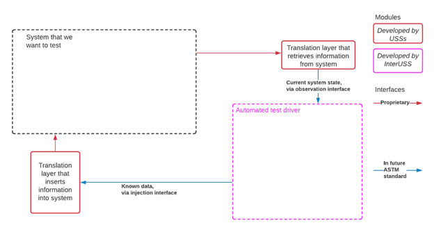

# USS Qualifier: Automated Testing

## Introduction

The UTM eco-system is a complex distributed system involving multiple service providers.
[F3548-21 Appendix X6]() describes the challenges and defines an UTM Ecosystem Testing Strategy.
The USS Qualifier gathers multiple automated testing suite in a consistent framework.
Its main purpose is to automate testing compliance with standards and the interoperability of multiple
service providers.

It currently targets compliance with the following standards:
- Remote ID [F3411-19]()
- Strategic Conflict Detection [F3548-21]():
    - Strategic Coordination and UAS Flight Authorisation [EU Regulation 2021/664]()

## Test definitions

> To refine
1. Service: Service to be tested usually linked to a standard (example: Remote ID, Strategic Coordination)
2. Locale: Specifies the region and may include some specific checks / adaptation required by the competent authority. (example: )
3. Scenario: Set of tests logically grouped. (Nominal Behavior Test, Complex Behavior Test, etc.)
4. Test: Sequence of injected requests and expected observations.

## Testing approach

The testing approach is based on three steps:
1. Inject known data
2. Observe
3. Check results

A test scenario should be idempotent, so it can be audited and replayed. A simulator is used to generate the test scenarios which can be replayed.
The interfaces as shown in the figure above need to be implemented by the USSs, so the test driver
can submit requests to proprietary interfaces in a standard manner, likewise to retrieve
information using the observation interface.

### Testing interfaces

To enter the qualification tests, a USS shall implement the following testing interfaces:

- [Remote ID F3411-19]()
- [Strategic coordination F3548-21 and UAS Flight Authorisation EU Regulation 2021/664]()

## Automated test driver architecture

The uss qualifier implements the automated test driver. It is composed of the following elements:

### Scenario Simulator

It is responsible to generate the scenarios as a deterministic test sequence.

### Scenario Player and Evaluator

It is responsible to play a simulation by sending requests to the test interface using
the test information generated by the simulator.

The Evaluator is responsible to analyze the response of the Simulation Player and run specific checks
to assess the status of the overall system.

In some cases, those two components may be split to allow the evaluation of asynchronous states.
For instance in Remote ID, it is possible that the service provider under test may be different than
the display provider.

### Test Executor

It is responsible for the overall orchestration of the test sequence, namely notifying to the test interfaces
about the status of the test (Setup, Teardown), starting the simulation player and gathering results
from the evaluator in a report.

### WebApp

A web application is provided to offer a user interface allowing users to start tests and retrieve reports.
It can be deployed to offer the staging qualification environment a self-service interface.

## Environments and execution modes

The test suite is being built to run in the two following modes: Self qualification and Staging qualification

### Self qualification

This execution mode is targeting USS internal process. The self qualification should be run locally
on the USS Infrastructure. No external systems should be required since mock components are available for
all systems not under test. The objective of this step is to ensure the USS implementation is functionally compliant with
the service evaluated.

### Staging qualification

Every USS Providers should provide an interoperability test instance as required by [F3548-21 (GEN0300)]().
This test instance will be configured to connect to other USS Providers test instances.
This environment is called Staging.
