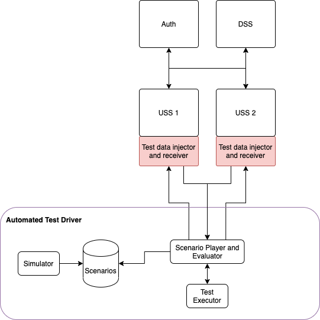

# Strategic Coordination: Testing Scenarios

## Architecture

## Nominal behavior test

This scenario exercises basic functionality of Strategic Coordination.
[These sequence diagrams](./testing-scenarios-nominal.plantuml) describe the ASTM requirements this scenario should validate and how.

### Priority

Test functionality in the case of operational intent with multiple priority levels.

### Same priority allowed

Test functionality in the context that regulations allow conflicts for operational intent with the same priority.

### Off-nominal behaviour tests

This scenario tests off-nominal responses in the system.

### UAS / Operator tests

> TODO
